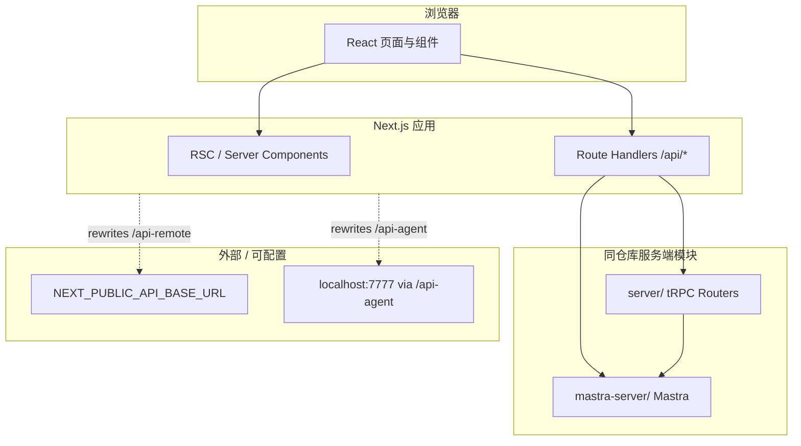

# 架构说明

本文描述仓库的整体结构、运行时边界与主要数据流，便于新成员与后续迭代时对齐上下文。

## 1. 总览

项目是一个 **Next.js App Router** 全栈应用（默认开发端口 **3001**），主要包含：

- **营销 / 个人站点**：多语言落地页与简历等，路由在 `src/app/[lang]/` 下。
- **Agent 对话**：`/agent` 下的聊天界面，依赖 NextAuth 登录、tRPC 管理线程、Mastra 流式对话。
- **管理**：`[lang]/admin` 下的内部工具入口与账号改密。英文无前缀，公开地址是 `/admin`。
- **类型安全 API**：`server/` 中的 tRPC 路由，经 `src/app/api/trpc` 暴露。
- **AI 运行时配置**：`mastra-server/` 中的 Mastra 实例、Agent、工具与工作流，被 API Route 与同进程 tRPC 直接引用。

```mermaid
flowchart TB
  subgraph browser [浏览器]
    UI[React 页面与组件]
  end
  subgraph next [Next.js 应用]
    RSC[RSC / Server Components]
    API[Route Handlers /api/*]
    UI --> RSC
    UI --> API
  end
  subgraph server_code [同仓库服务端模块]
    TRPC[server/ tRPC Routers]
    MASTRA[mastra-server/ Mastra]
  end
  API --> TRPC
  API --> MASTRA
  TRPC --> MASTRA
  subgraph external [外部 / 可配置]
    REMOTE[NEXT_PUBLIC_API_BASE_URL]
    AGENT_SVC[localhost:7777 via /api-agent]
  end
  next -.->|rewrites /api-remote| REMOTE
  next -.->|rewrites /api-agent| AGENT_SVC
```

## 2. 目录与职责

| 路径 | 职责 |
|------|------|
| `src/app/` | App Router 页面、`layout.tsx`、`error.tsx`、API Routes |
| `src/components/` | 应用级 UI（路由壳、尚未抽到 `biz-ui` 的组合件等） |
| `packages/design-system` | 原子组件（`@landing-page/design-system`） |
| `packages/biz-ui` | 可复用业务组合件（`@landing-page/biz-ui`）；按需抽取，不批量迁移 |
| `packages/utils` | 共享工具（`@landing-page/utils`） |
| `src/styles/` | 全局样式入口、主题（light / dark / shinchan / apple）与页面特征样式 |
| `src/lib/` | 工具函数、i18n 封装、chat/stream、tRPC 客户端封装等 |
| `src/locales/` | Lingui 编译产物与 `.po` 源（按语言分文件） |
| `server/` | tRPC `appRouter` 及各子路由（user / model / thread） |
| `mastra-server/` | Mastra 单例、agents、tools、workflows、storage |
| `docs/` | 补充文档（i18n、技术栈、本文档等） |

### 路径别名（`tsconfig.json`）

- `@landing-page/design-system` → `packages/design-system`
- `@landing-page/biz-ui` → `packages/biz-ui`
- `@landing-page/utils` → `packages/utils`
- `@/*` → `src/*`
- `~/*` → 仓库根目录（用于引用 `server/`、`lingui.config` 等）
- `$` / `$/*` → `mastra-server`（Mastra 专用短别名）

### 前端组件分层

单向依赖：`src` → `biz-ui` → `design-system` → `utils`。`src` 也可以直接用 `design-system` 与 `utils`。

- **design-system**：无业务语义的原子组件（Button、Input、Card）。
- **biz-ui**：原子之上、页面之下的可复用组合件；数据、路由、鉴权全部通过 props/slots 注入。允许依赖 `design-system`、`utils`、`react`。禁止依赖 `next`、Lingui、tRPC、Zustand、NextAuth、`@/`、`~/server`、`mastra-server`。
- **src**：路由、tRPC、Zustand、Lingui、NextAuth，以及只服务单个页面的组件（`src/app/.../_components`）。

新的可复用组合件直接写在 `packages/biz-ui`。从 `src` 抽取时：去掉 `@/` 依赖，把 hook/store/i18n 改成 props，再改 import。不要批量搬家。查看工作区包依赖：`nr graph`。

## 3. 路由结构

### 3.1 多语言站点 `src/app/[lang]/`

- 动态段 `[lang]` 与 `src/lib/i18n/locales.ts` 中的 `locales` 对齐；`generateStaticParams` 在根 layout 中为每种语言生成静态参数。`lingui.config.ts` 从同一文件读取。
- 子路由示例：`(home)/` 首页、`resume/` 简历页、`auth/` 授权页等。
- 根 layout 负责：`Lingui` 服务端/客户端、`ThemeProvider`、全局样式与 `SettingsMenu`。

### 3.2 Agent `src/app/agent/`

- 独立 `layout.tsx`：全屏布局，读取 NextAuth 会话给侧边栏用，**不在 layout 里做登录跳转**。
- 是否需要登录由 `src/lib/page-auth.ts` 的 `protectedPages` 声明，`src/proxy.ts` 统一拦截。
- 挂载 `TankQueryClientProvider`（tRPC + React Query），侧边栏与 `ChatModeSwitcher`。
- 动态线程页：`agent/[threadId]/page.tsx`。

### 3.3 认证 `src/app/[lang]/auth/`

- NextAuth v5：`src/auth.ts`（账号 + 密码，校验走 Turso `auth_users` 表上的 `verifyCredentials`）、`src/app/api/auth/[...nextauth]/route.ts`。首次没有用户时写入超级管理员 `marvin`。
- JWT session，8 小时；`session.user.id` 为登录账号。
- 唯一认证页在 `[lang]/auth`。英文无前缀，公开地址是 `/auth`；其他语言是 `/{lang}/auth`。`pages.signIn` 仍是 `/auth`。
- `/auth/signin` 与 `/auth/resume` 只做兼容跳转，并带上当前语言。
- 受保护路径由 `src/lib/page-auth.ts` 的 `protectedPages` 配置。未登录访问时 `src/proxy.ts` 跳到对应语言的 `/auth?returnTo=...`（例如 `/zh/resume` → `/zh/auth`）。认证页本身不在受保护列表里。完整路径见 [auth.md](./auth.md)。

### 3.4 管理 `src/app/[lang]/admin/`

- 需登录。聚合入口、`/admin/users` 账号列表。角色为 `super_admin` / `admin` / `guest`；只有超级管理员可以创建管理员或访客、修改密码。catch-all `[...params]`。
- 英文无前缀，公开地址是 `/admin`；其他语言是 `/{lang}/admin`。沿用 `[lang]` 的语言、主题和设置菜单。

### 3.5 国际化与 `src/proxy.ts`

- Next.js 16 使用 `src/proxy.ts` 作为请求拦截入口（不再需要根目录 `middleware.ts`）。
- 先按 `protectedPages` 做会话门闩（matcher 包含 `agent`、`admin` 和带语言前缀的受保护页），再做 locale 检测与重写。`/admin` 与 `/resume` 一样会重写到默认语言；`/{lang}/admin` 直接放行。`/auth` 会重写到默认语言；`/{lang}/auth` 直接放行。

## 4. 数据层与 API

### 4.1 tRPC

- **入口**：`src/app/api/trpc/[trpc]/route.ts` → `fetchRequestHandler` + `appRouter`。
- **聚合路由**：`server/index.ts` 组合 `user`（Turso 账号列表与是否可管理 / 创建 / 改密）、`model`、`thread`。
- **上下文**：`server/trpc.ts` 的 `createTRPCContext` 注入 `next-auth` 的 `session`；`protectedProcedure` 要求已登录用户。
- **客户端**：`src/lib/trpc.ts` 使用 `@trpc/tanstack-react-query` 的 `TRPCProvider` / `useTRPC`；在 Agent 布局中挂载。

### 4.2 线程与 Mastra Memory

- `server/thread/index.ts` 通过 `mastra.getAgent(...).getMemory()` 操作线程列表、创建与更新等，与聊天 API 中的 `threadId` / `resourceId`（用户 id）一致。

### 4.3 Chat 流式 API

- `src/app/api/chat/route.ts`：`auth()` 校验 → `handleChatStream`（`@mastra/ai-sdk`）→ `createUIMessageStreamResponse`（`ai` 包）。
- 使用 `mastra-server` 导出的单例与默认 `AGENT_ID`。

### 4.4 其他 API

- `src/app/api/knowledge/chat/route.ts`、`src/app/api/email/test/route.ts` 等，按功能拆分。

### 4.5 Next.js `rewrites`（`next.config.ts`）

- `/api-remote/:path*` → `NEXT_PUBLIC_API_BASE_URL`，用于前端以同源路径代理后端。
- `/api-agent/:path*` → `http://localhost:7777`，用于独立 Agent 服务（若运行）。

## 5. Mastra 子系统

详见 [mastra-server/README.md](../mastra-server/README.md)。要点：

- `mastra-server/index.ts` 注册 agents（如 general、knowledge）、workflow、LibSQL storage、日志与 observability。
- 与 Next 进程**同一 Node 运行时**内 import，无单独 HTTP 端口要求（与可选的 `localhost:7777` 外部服务不同）。

## 6. 前端状态与流式 UI

- **流式聊天**：`src/lib/stream/`、`use-chat-stream-state` 等与 AI SDK / Mastra 流对接。
- **UI 栈**：Tailwind CSS 4、Radix、Framer Motion / Motion、GSAP、统一 Markdown（unified 管线）等。

## 7. 国际化（Lingui）

- 构建链：`@lingui/swc-plugin`、`@lingui/loader`（`.po` → Turbopack）、`postinstall` 执行 `lingui compile`。
- 运行时：`src/lib/i18n/appRouterI18n.ts`（`server-only`）加载各语言 catalog；开发环境用 `.po`，生产构建用编译后的 `.js`。
- 更细的用法见 [i18n.md](./i18n.md)。

## 8. 质量与工具

- **Biome**：lint / format（`biome.json`，pre-commit 经 `simple-git-hooks` 触发 `check:staged`）。
- **React Compiler**：`next.config.ts` 中 `reactCompiler: true`。
- **包管理**：`pnpm`（`packageManager` 字段锁定版本）。

## 9. 相关文档

- [授权路径](./auth.md)
- [技术栈清单](./tech-stack.md)
- [i18n](./i18n.md)
- [Mastra 目录说明](../mastra-server/README.md)
- 根目录 [README](../README.md)

版本与依赖以仓库内 `package.json` 为准；`docs/tech-stack.md` 中的版本号若与 `package.json` 不一致，以 **`package.json` 为权威**。
