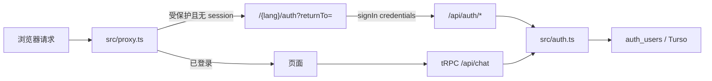

# 授权路径

当前站点的登录、页面门闩与接口鉴权。改路由、中间件、登录页或账号权限时先看本文；架构总览见 [architecture.md](./architecture.md)。

## 1. 分层

授权分四层，职责不重叠：

| 层 | 文件 | 做什么 |
|---|---|---|
| NextAuth 配置 | `src/auth.ts` | Credentials 登录、JWT session、导出 `auth` / `signIn` / `signOut` / `handlers` |
| HTTP 入口 | `src/app/api/auth/[...nextauth]/route.ts` | 把 `handlers` 挂成 `GET` / `POST` |
| 页面门闩 | `src/lib/page-auth.ts` + `src/proxy.ts` | 声明受保护路径；未登录时跳到对应语言的 `/auth?returnTo=...` |
| 账号与角色 | `src/lib/auth-users/store.ts` | Turso `auth_users` 表：校验密码、读写角色 |

`page-auth` **不创建 session**。它只决定「哪些页面要登录」以及「登录页 URL / 回跳是否安全」。

## 2. 受保护页面

声明在 `src/lib/page-auth.ts` 的 `protectedPages`：

| `path` | `locale` | 公开地址 | 说明 |
|---|---|---|---|
| `/resume` | `true` | `/resume`，其他语言 `/{lang}/resume` | 简历；未登录不可看 |
| `/admin` | `true` | `/admin`，其他语言 `/{lang}/admin` | 管理入口与子页 |
| `/agent` | `false` | 只有 `/agent`，无语言前缀 | Agent 对话与线程页 |

`locale: true` 会同时匹配无前缀和所有 `/{lang}` 前缀（含 `/en/...`）。`locale: false` 只匹配该 path 本身及其子路径。

**不是**受保护页：`/`、营销页、`/auth`、`/auth/signin`、`/auth/resume`。认证页本身不会被门闩再踢回登录。

匹配是前缀匹配：`/admin/users`、`/zh/resume/`、`/agent/thread-1` 都会命中。`/agency` 这种前缀相似路径不会命中。

## 3. 请求怎么走

Next.js 16 用 `src/proxy.ts` 拦截页面请求（不再需要根目录 `middleware.ts`）。

顺序：

1. `getProtectedPage(pathname)`。
2. 命中受保护页则 `await auth()`。
   - 没有 `session.user.id` → `302` 到 `getAuthorizationUrl(pathname)`。
   - 已登录且 `locale: false`（`/agent`）→ `next()`，不再做语言重写。
   - 已登录且 `locale: true` → 走下面的 locale 逻辑。
3. 未命中受保护页 → 只做 locale 检测与重写。

Locale 规则（与授权无关，但和回跳地址叠在一起）：

- 默认语言是 `en`（`sourceLocale`）。`/en` 与 `/en/...` 会 **redirect** 掉前缀。
- 其他语言 `/{lang}/...` 直接放行。
- 无语言前缀的页面（如 `/auth`、`/admin`、`/resume`）**rewrite** 到 `/en/...`。

`/api`、`/agui`、静态资源不进 matcher，**页面门闩管不到 API**。API 各自再调 `auth()`。

`/resume` 与 `/admin` 的响应会额外带 `Cache-Control: private, no-store` 和 `X-Robots-Tag: noindex, nofollow, noarchive`。`/agent` 不带这组头。

## 4. 登录与回跳

唯一认证页：`src/app/[lang]/auth/page.tsx`。

| 语言 | 公开 URL |
|---|---|
| `en` | `/auth` |
| 其他 | `/{lang}/auth` |

NextAuth `pages.signIn` 仍是 `/auth`（英文无前缀）。

### 4.1 生成登录 URL

`getAuthorizationUrl(returnTo, locale?)`：

1. `getSafeReturnTo(returnTo)` 清洗回跳。
2. 语言优先用传入的 `locale`；否则取 `returnTo` 第一段是否为合法 locale；再否则 `en`。
3. `en` 不加前缀，其他语言加 `/{lang}`。
4. 得到 `/{lang}/auth?returnTo=...`。

例子：

- `/zh/resume` → `/zh/auth?returnTo=%2Fzh%2Fresume`
- `/agent` → `/auth?returnTo=%2Fagent`
- `/agent` + 显式 `ja` → `/ja/auth?returnTo=%2Fagent`

### 4.2 `returnTo` 安全规则

只接受站内相对路径，且必须仍是受保护路径：

- 必须以 `/` 开头，不能是 `//` 或带 `://`。
- 公开路径、绝对 URL、协议相对 URL 一律变成 `/`。
- 登录成功后只允许回到 `/resume`、`/admin`、`/agent` 及其合法语言/子路径。

### 4.3 登录动作

认证页 Server Action 调 `signIn("credentials", { username, password, redirectTo: returnTo })`。

- 已有 session：直接 `redirect(returnTo)`。
- 账号密码错误：`AuthError` → 回到同一登录 URL 并带 `error=invalid`。
- `src/auth.ts` 的 `authorize`：无 `AUTH_SECRET`、非字符串凭据、或 `verifyCredentials` 失败，都返回 `null`（登录失败）。

成功时 session 里的 `user.id` / `user.name` 是登录账号，`user.email` 为 `{username}@local.dev`（本地占位，不是真实邮箱）。

### 4.4 兼容跳转

旧地址只做 redirect，不再单独渲染：

- `/auth/signin`（及 `/{lang}/auth/signin`）→ `getAuthorizationUrl(returnTo ?? callbackUrl ?? from ?? "/", lang)`
- `/auth/resume` → 默认回跳到当前语言的 `/resume`

### 4.5 登出

Agent 侧边栏用客户端 `signOut({ callbackUrl: "/auth" })`。登出后落到英文登录页。

## 5. Session

- 策略：JWT。
- 有效期：8 小时（`maxAge: 8 * 60 * 60`）。
- `session.user.id` = JWT `token.sub` = 登录用户名。
- **角色不进 JWT**。需要角色时再查 Turso（`getUserRole`）。

类型扩展在 `src/types/next-auth.d.ts`。

## 6. 账号与角色

存储：Turso，表 `auth_users`（`username` PK、`password_hash`、`role`、`updated_at`）。

环境变量：`TURSO_DATABASE_URL`（必须）、`TURSO_DATABASE_AUTH_TOKEN`。缺 URL 时 store 抛 `storage_not_configured`；登录校验捕获后当作失败。

空表时写入种子超级管理员：用户名 `marvin`，角色 `super_admin`。密码在 `src/lib/auth-users/store.ts` 的常量里，只用于首次初始化。

角色：

| 角色 | 谁能创建 | 页面访问 | 账号管理 |
|---|---|---|---|
| `super_admin` | 仅种子写入，不能再创建 | 所有受保护页 | 可创建 `admin` / `guest`、改任何人密码 |
| `admin` | 超级管理员 | 所有受保护页 | 只读用户列表 |
| `guest` | 超级管理员 | 所有受保护页 | 只读用户列表 |

页面门闩**只看是否登录**，不看角色。任何已登录角色都能打开 `/admin` 和 `/admin/users`。写操作在 tRPC 里再卡 `super_admin`。

Admin 页面本身不调 `auth()`；靠 proxy 挡未登录访问。

## 7. API 鉴权

`/api` 不走 `proxy` matcher，必须自己验 session。

| 入口 | 规则 |
|---|---|
| `server/trpc.ts` 的 `protectedProcedure` | 无 `session.user.id` → `UNAUTHORIZED` |
| `server/user` 的 `create` / `updatePassword` | 已登录 + `getUserRole === "super_admin"`，否则 `FORBIDDEN` |
| `server/user` 的 `list` | 已登录即可；`canManage` 表示是否超级管理员 |
| `server/thread` | 全部 `protectedProcedure`，用 `ctx.userId` 当 Mastra `resourceId` |
| `src/app/api/chat/route.ts` | `auth()`；无用户 → HTTP 401 |

`Agent` layout 会 `auth()` 把 `user` 传给侧边栏，**不在 layout 里 redirect**。未登录进 `/agent` 由 proxy 处理。

## 8. 环境变量

| 变量 | 作用 |
|---|---|
| `AUTH_SECRET` | NextAuth 签发 JWT；缺失则 `authorize` 直接失败 |
| `TURSO_DATABASE_URL` | 账号表 |
| `TURSO_DATABASE_AUTH_TOKEN` | Turso token |

见 `.env.example`。

## 9. 文件地图

| 路径 | 职责 |
|---|---|
| `src/auth.ts` | NextAuth 配置与导出 |
| `src/app/api/auth/[...nextauth]/route.ts` | Auth HTTP handlers |
| `src/lib/page-auth.ts` | 受保护页、安全回跳、登录 URL |
| `src/proxy.ts` | 会话门闩 + locale rewrite |
| `src/app/[lang]/auth/page.tsx` | 唯一登录页 |
| `src/app/[lang]/auth/signin/page.tsx` | 兼容跳转 |
| `src/app/[lang]/auth/resume/page.tsx` | 兼容跳转（默认回简历） |
| `src/lib/auth-users/store.ts` | Turso 账号 CRUD / 校验 |
| `src/lib/auth-users/roles.ts` | 角色枚举 |
| `src/lib/auth-users/password.ts` | 密码哈希 |
| `server/trpc.ts` | tRPC session 上下文与 `protectedProcedure` |
| `server/user/index.ts` | 用户列表与超级管理员写操作 |
| `src/app/api/chat/route.ts` | 聊天流式接口的 session 校验 |
| `src/lib/page-auth.test.ts` | 门闩与回跳单测 |

改受保护范围：只改 `protectedPages`，不要在各个 page/layout 里再散落 redirect。改登录协议或 session 形态：改 `src/auth.ts`。改谁能管账号：改 `server/user` 与 `roles.ts`。
