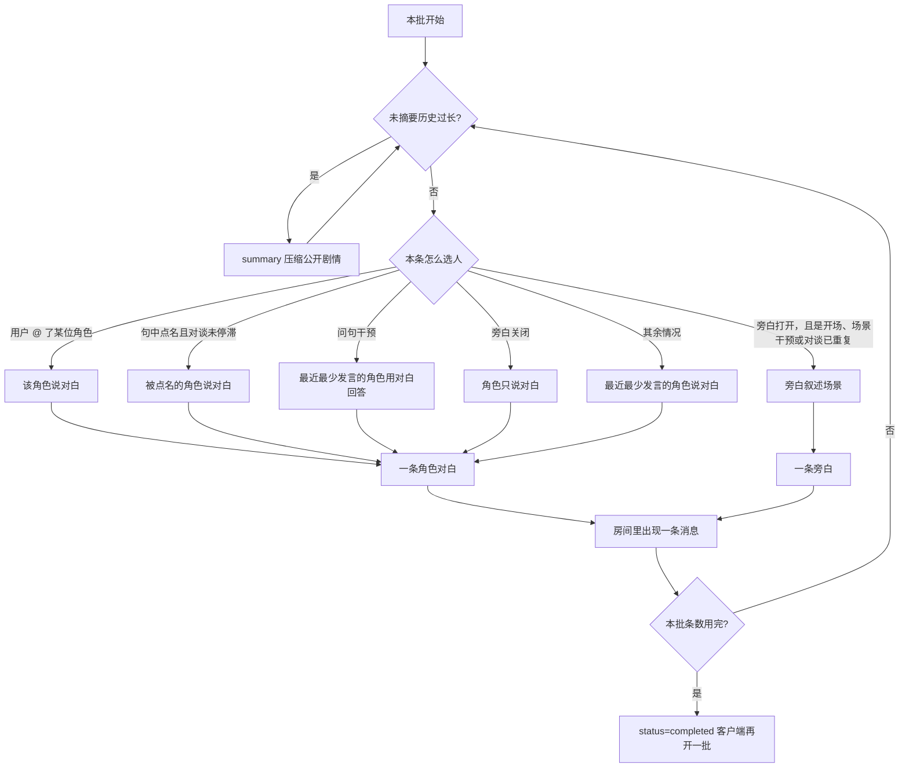

角色只输出对白。`narration` 默认关闭；打开后，开场、场景类干预和已经重复的对谈才由旁白叙述。问句干预和点名始终交给对应角色。

```mermaid
flowchart TD
  start[本批开始] --> summary{未摘要历史过长?}
  summary -->|是| sumAgent[summary 压缩公开剧情]
  sumAgent --> summary
  summary -->|否| pick{本条怎么选人}
  pick -->|用户 @ 了某位角色| named[该角色说对白]
  pick -->|句中点名且对谈未停滞| reply[被点名的角色说对白]
  pick -->|问句干预| ask[最近最少发言的角色用对白回答]
  pick -->|旁白关闭| talk[角色只说对白]
  pick -->|旁白打开，且是开场、场景干预或对谈已重复| narrate[旁白叙述场景]
  pick -->|其余情况| least[最近最少发言的角色说对白]
  named --> line[一条角色对白]
  reply --> line
  ask --> line
  talk --> line
  least --> line
  narrate --> narrator[一条旁白]
  line --> visible[房间里出现一条消息]
  narrator --> visible
  visible --> next{本批条数用完?}
  next -->|否| summary
  next -->|是| done[status=completed 客户端再开一批]
```
