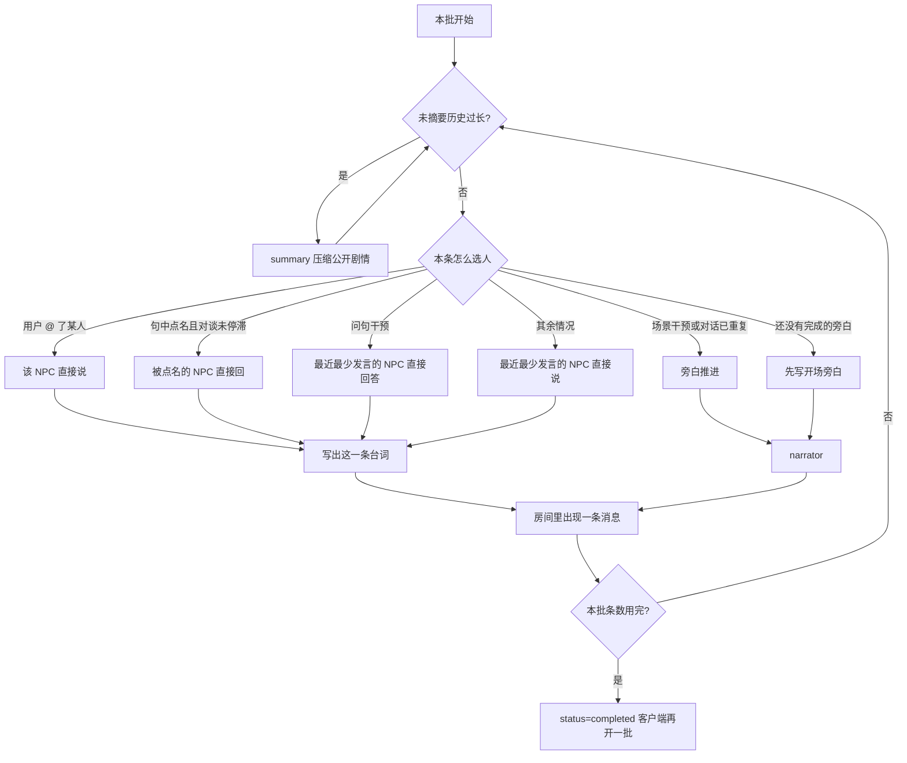

```mermaid
flowchart TD
  start[本批开始] --> summary{未摘要历史过长?}
  summary -->|是| sumAgent[summary 压缩公开剧情]
  sumAgent --> summary
  summary -->|否| pick{本条怎么选人}
  pick -->|用户 @ 了某人| named[该 NPC 直接说]
  pick -->|句中点名且对谈未停滞| reply[被点名的 NPC 直接回]
  pick -->|问句干预| ask[最近最少发言的 NPC 直接回答]
  pick -->|场景干预或对话已重复| narrate[旁白推进]
  pick -->|还没有完成的旁白| open[先写开场旁白]
  pick -->|其余情况| least[最近最少发言的 NPC 直接说]
  named --> line[写出这一条台词]
  reply --> line
  ask --> line
  least --> line
  narrate --> narrator
  open --> narrator
  line --> visible[房间里出现一条消息]
  narrator --> visible
  visible --> next{本批条数用完?}
  next -->|否| summary
  next -->|是| done[status=completed 客户端再开一批]
```