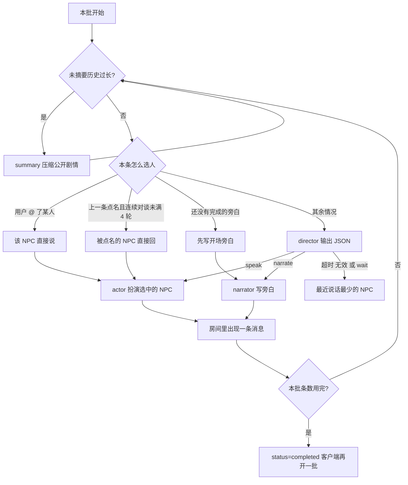

```mermaid
flowchart TD
  start[本批开始] --> summary{未摘要历史过长?}
  summary -->|是| sumAgent[summary 压缩公开剧情]
  sumAgent --> summary
  summary -->|否| pick{本条怎么选人}
  pick -->|用户 @ 了某人| named[该 NPC 直接说]
  pick -->|上一条点名且连续对谈未满 4 轮| reply[被点名的 NPC 直接回]
  pick -->|还没有完成的旁白| open[先写开场旁白]
  pick -->|其余情况| director[director 输出 JSON]
  director -->|speak| actor[actor 扮演选中的 NPC]
  director -->|narrate| narrator[narrator 写旁白]
  director -->|超时 无效 或 wait| fallback[最近说话最少的 NPC]
  named --> actor
  reply --> actor
  open --> narrator
  actor --> visible[房间里出现一条消息]
  narrator --> visible
  visible --> next{本批条数用完?}
  next -->|否| summary
  next -->|是| done[status=completed 客户端再开一批]
```